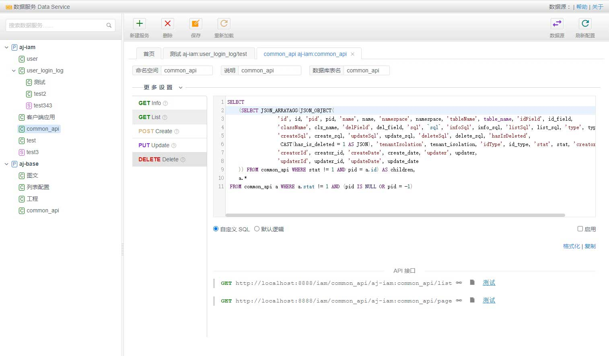

# Data Service UI

Rapidly Build CRUD Interface Services with Just SQL Business Logic (Even Zero-Code!). The Simplest Approach: Zero-code configuration of parameters on the page automatically generates SQL and converts it into an HTTP API. In Java enterprise development, writing Model, DAO, Service, and Controller code can be a tedious task, involving a lot of repetitive work. Data services are designed to address this issue. Based on the increasing complexity of business scenarios, data services can be applied in three modes:

1. Large Volume of Basic Data

These data tables typically have little or no common business logic. Using DataService to create generic CRUD services is sufficient.

2. Customized Business Logic Beyond Simple CRUD

If SQL can still handle the business logic, no additional Java code is required, making it ideal for backend interface development in BI reports and data visualization dashboards.

3. Complex Business Logic Requiring Collaboration of Java and SQL

DataService can still serve as an ORM mechanism, acting as a Data Access Object to return Java Bean entities.

Data services are not code generators. Rather, they abstract common CRUD tasks into a configurable rapid business development tool.

The style of API is based on CRUD(Create, Read, Update, Delete), For greater precision, let's delineate the topic into the following specific aspects:

- Single Value Retrieval: to get a value, int or other numbers, or string, boolean, etc.
- Detail Retrieval: to get a detail(info), a Map or a Java Bean, return as JSON Object
- List Retrieval: to get list, might be a list of Map or a list of Java Bean, return as JSON Array
- Paged List Retrieval: to get paging list, with the field 'total' for the count
- Record Creation: to create a record, return the ID of the record
- Record Update: to update a record, return the boolean value that the record is updated
- Record Deletion: to delete a record, return the boolean value that the record is deleted
- Batch Updates: Performing multiple update operations in a single batch process
- Custom SQL Execution: Executing custom SQL queries, complemented by Java code to ensure the completion of complex business logic

Additional Points:

- Data services simplify data access and reduce development time.
- They promote code reuse and maintainability.
- They enhance developer productivity and efficiency.
- They enable rapid prototyping and iterative development.

Overall, data services offer a powerful and flexible approach to building data-driven applications in Java.

# The Server Side
This is Front-end code. For the server side, please visit: https://github.com/lightweight-component/aj-data.